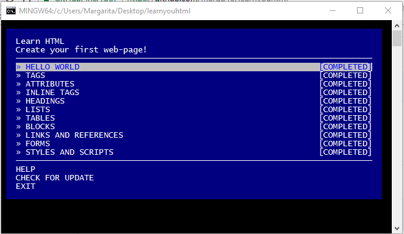

# learnyouhtml
Resolver los ejercicios mostrados en el bash.

### Ejercicios
Workshopper consta de 11 ejercicios basados en HTML.

* **HELLO WORLD** — introduction to HTML.
* **TAGS** — understanding tags.
* **ATTRIBUTES** — what is tag's attributes.
* **INLINE TAGS** — tags for styling text.
* **HEADINGS** — tags for headings.
* **LISTS** — how to create a list with HTML tags.
* **TABLES** — how to compose data in table.
* **BLOCKS** — block tags and semantic.
* **LINKS AND REFERENCES** — how to leave a references to another page.
* **FORMS** — creating of forms with control elements.
* **STYLES AND SCRIPTS** — injecting styles and scripts on a page.

### Requerimientos

* [**Node.js**](node-url) >=8.9.0

### Instalación

Abrir el terminal git bash y ejecutar el siguiente comando:

```
npm install -g learnyouhtml
```

### Usa

El siguiente comando permitira abrir la lista de ejercicios, por lo cual tambien te permitirá verificar tu resolucion:

```
learnyouhtml
```

